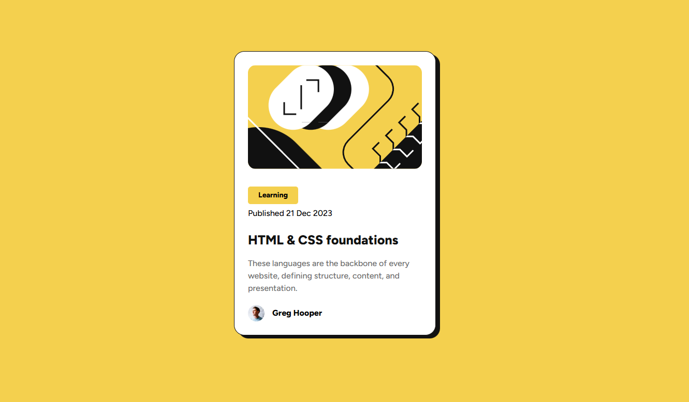
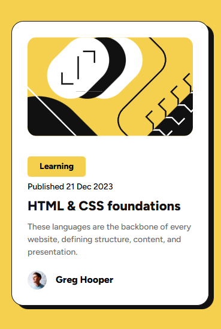

# Frontend Mentor - Blog preview card solution

This is a solution to the [Blog preview card challenge on Frontend Mentor](https://www.frontendmentor.io/challenges/blog-preview-card-ckPaj01IcS).

## Table of contents

- [Overview](#overview)
  - [Screenshot](#screenshot)
  - [Links](#links)
- [My process](#my-process)
  - [Built with](#built-with)
  - [What I learned](#what-i-learned)
- [Author](#author)

## Overview

Layout from Frontend Mentor. A page with a centered simple blog article card with an cover, date of publication, text and author.

### Screenshot

Desktop 1440px

Mobile 370px

### Links

- Solution URL: [GitHub](https://github.com/BogdanSDev/Blog-preview-card-Frontend-Mentor/tree/main?tab=readme-ov-file)
- Live Site URL: [GitHub Pages](https://bogdansdev.github.io/Blog-preview-card-Frontend-Mentor/)

## My process

### Built with

- Semantic HTML5 markup
- CSS custom properties
- CSS BEM convention
- Flexbox layout

### What I learned

 - Aligning blocks and text using flexbox
 - Connecting custom fonts locally from a file
 - Sematic HTML markup
 - box-shadow CSS property
 - Normalizing CSS styles
 - Working with media queries
 - Git basics

## Author
Bogdan Sinitsyn
- GitHub - [BogdanSDev](https://github.com/BogdanSDev)
- Frontend Mentor - [@BogdanSDev](https://www.frontendmentor.io/profile/BogdanSDev)
